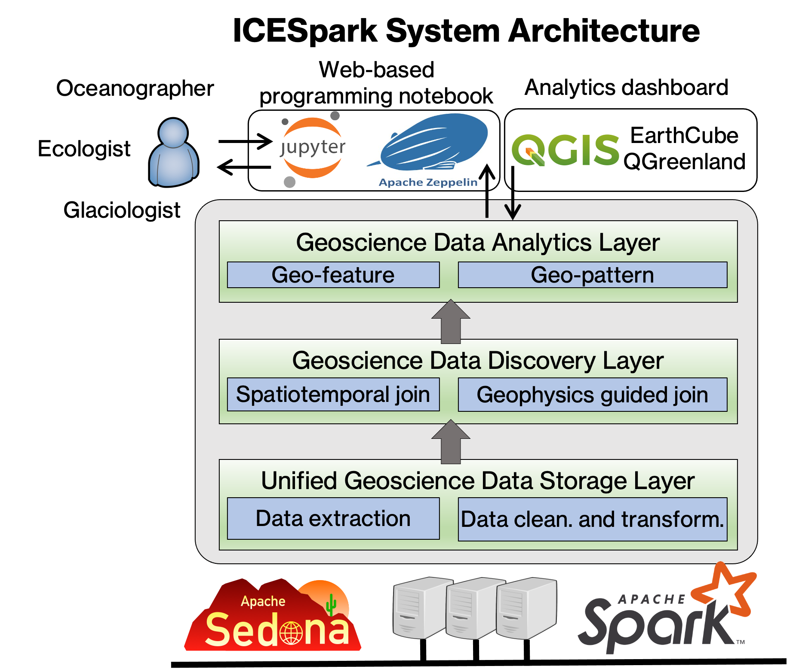

# Welcome to ICESpark website

ICESpark is an open-source distributed platform that can combine local commodity computers into a powerful environment that is ready for geospatial big data (GeoBD) analytics in the Arctic and beyond.

## System architecture

Built on [Apache Sedona](https://sedona.apache.org/), ICESpark offers the following functionalities:

1. Data integration and cleaning tools to harness a wide variety of GeoBD across geoscience domains including oceanography, cryospheric science and ecology.
2. A scalable data discovery layer to efficiently identify all coincidental data across streams from heterogeneous sensing platforms (e.g., ICESat-2, Jason-3, Sentinel-3, GEDI) under various conditions.
3. Advanced data analytics capabilities, including a geo-feature identification system and a geo-pattern mining package, to equip geoscientists with geophysical or statistical tools to examine complex relationships and patterns embedded in GeoBD.
4. A variety of pre-packed front-ends including Jupyter notebooks as well as interoperation with EarthCube’s QGreenland, improving the accessibility to the system across broad disciplinary communities.